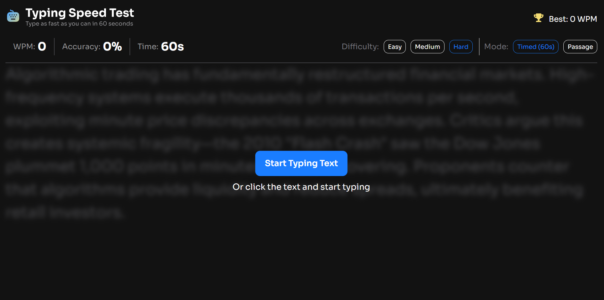

# Frontend Mentor - Typing Speed Test solution

This is my solution to the [Typing Speed Test challenge on Frontend Mentor](https://www.frontendmentor.io/challenges/typing-speed-test). The project focuses on building an interactive typing test with real-time feedback, multiple modes, and performance tracking.

## Table of contents

- [Overview](#overview)
  - [The challenge](#the-challenge)
  - [Screenshot](#screenshot)
  - [Links](#links)
- [My process](#my-process)
  - [Built with](#built-with)
  - [What I learned](#what-i-learned)
  - [Continued development](#continued-development)
  - [Useful resources](#useful-resources)
  - [AI Collaboration](#ai-collaboration)
- [Author](#author)

## Overview

### The challenge

Users should be able to:

- Complete a typing test with real-time feedback
- See live updates for:
  - Words per minute (WPM)
  - Accuracy
  - Timer (for timed mode)
- Switch between:
  - Timed mode (60s)
  - Passage mode
- View a results screen after completion
- See their best score updated dynamically
- Experience responsive layouts across devices

### Screenshot



### Links

- Solution URL: [Github](https://github.com/WesSno/Typing-Test)
- Live Site URL: [Netlify](https://kbk-typing-test.netlify.app/)

## My process

### Built with

- React (Hooks: useState, useEffect, useRef)
- JavaScript (ES6+)
- CSS (Flexbox, Grid, responsive design)
- Mobile-first workflow
- Vite (for development)

### What I learned

This project helped me understand how to manage real-time interactions in React and handle edge cases in user input.

1. Preventing double execution in React

```JavaScript
const hasFinishedRef = useRef(false);

if (hasFinishedRef.current) return;
hasFinishedRef.current = true;
```

&rarr; This helped prevent multiple triggers of the finish logic

2. Accurate WPM calculation without delay

   Instead of relying on state updates that lag, I used snapshots:

```JavaScript
const currentTimeLeft = timeLeft;
const currentTypedText = typedText;
```

&rarr; This ensured the final WPM doesn't drop before results display

3. Handling different test modes

I implemented two distinct behaviours:

```JavaScript
if (timeMode === "Passage") {
  timeSpent = (Date.now() - startTime) / 1000;
}
```

4. Preventing unfair scoring

To avoid users cheating by typing random characters:

- Accuracy threshold added at 90%
- Only valid results update best score

5. Improving UX

- Disabled browser spellcheck and autofill
- Prevented input overflow
- Added character comparison feedback (correct / incorrect)

### Continued development

In future improvements, I plan to:

- Implement caret tracking (cursor following text)
- Improve animation and transitions
- Add word-based analysis instead of character-based
- Improve accessibility (keyboard navigation, screen readers)

### Useful resources

- [Frontend Mentor](https://www.frontendmentor.io/challenges/typing-speed-test) - This provided me with the necessary designs, style guide and other resources for the project

### AI Collaboration

I used ChatGPT during this project mainly for:

- Debugging complex React state issues
- Fixing timing and WPM calculation bugs
- Structuring cleaner logic for test completion
- Improving UX decisions (like disabling spellcheck and autofill)

- **What worked well:**
  - Breaking down complex bugs step-by-step
  - Identifying race conditions and state timing issues
  - Suggesting cleaner architecture (like separating finishTest)

- **What didn't:**
  - Some fixes needed iteration to match real behavior
  - Required manual testing to validate edge cases

## Author

- Name: **Kofi Baafi Kwatia**
- Frontend Mentor - [@WesSno](https://www.frontendmentor.io/profile/WesSno)
- Github - [@WesSno](https://github.com/WesSno)
